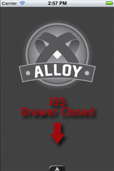
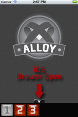
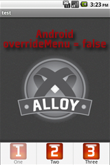
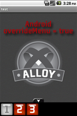

# Drawer Widget
## Overview

The **Drawer** widget provides a sliding panel of buttons to pull up from the bottom of the screen. As an option, the drawer can automatically close after it has been used. On Android, the drawer manifests itself as the activity menu, unless the developer wants to specifically override that capability.







## Manifest
* Version: 1.0 (stable)
* Github: https://www.github.com/appcelerator/alloy
* License: [Apache 2.0](http://www.apache.org/licenses/LICENSE-2.0.html)
* Author: Carl Orthlieb
* Supported Platforms: iOS, Android, Mobile Web

## Adding the Drawer Widget to Your Alloy Project

* In your application's config.json file you will want to include the following line in your dependencies:

```
"dependencies": {
    "com.appcelerator.drawer":"1.0"
}
```
* If the app/widgets directory doesn't exist in your app then create one.
* Copy the drawer folder from the test app (widget_drawer/app/widgets) into your app/widgets directory. 

## Create a Drawer in the View

You can add a drawer to a view by *requiring* the Drawer widget. 

	<Require type="widget" src="com.appcelerator.drawer" id="drawer"/>

Assign it an ID that you can use in your controller. E.g. `id="drawer"` You can now access the drawer via `$.drawer` in your controller. Note that the containing view needs to have a layout of "absolute", which is the default, and not "horizontal" or "vertical", in order to have the drawer work properly.

## Initializing the Drawer in the Controller

The drawer doesn't have any buttons in it until you initialize it in your controller. Before you open your window, you will want to call the drawer with the *init* method. For example:

```
$.drawer.init({
	mainWindow: $.index,
	buttons: [
    	{ id: 'One', title: 'One', click: function (e) { alert("One"); } },
        { id: 'Two', title: 'Two',  click: function (e) { alert("Two"); } },    
        { id: 'Three', title: 'Three',  click: function (e) { alert("Three"); } }    
    ],
    autoClose: true,
    gutter: 5
});
```
### Required Initialization Parameters

| Parameter | Type | Description |
| --------- | ---- | ----------- |
| mainWindow | *TiUIWindow* | You must supply a window for your drawer so that it can create menu items for the menu attached to the window's activity on Android. Typically, you'll pass in `$.<yourwindowid>` If you haven't changed the main window id then the Alloy default will be `$.index`. |
| buttons | *array* | The buttons array is an array of button objects each of which  describes a button to create in the drawer. |

#### button Object
| Parameter | Type | Description |
| --------- | ---- | ----------- |
| id | *string* | Unique id for this item. This id also selects the image icons for this button. The drawer expects to find the image at app/assets/images/\<id\>Enabled.png and app/assets/images/\<id\>Disabled.png. Default icon size is 48x48 pixels. |
| title | *string* | The text that describes this button that will appear underneath the icon (Android activity menu version only). |
| click | *function* | *Optional.* The callback to call when the button is clicked. The function has an event parameter similar to that used for regular buttons. If you don't specify a click callback then the button does nothing. |
| enabled | *function* | *Optional.* The callback to call to determine whether the button should be enabled. This callback should return true (enabled) or false (disabled). Default is for the buttons to always be enabled. |

### Optional Initialization Parameters

There are number of aspects of the Drawer that you can change, you can include these in your parameters when you call the init method.

| Parameter | Type | Affects | Description |
| --------- | ---- | ------- | ----------- |
| animationDuration | *integer* | iOS, MW | The duration, in milliseconds, of the animation to close/open the drawer. Default: *500* |
| autoClose | *boolean* | iOS, MW | If true, automatically closes the drawer after a button has been pressed. Default: *false* |
| closeOpacity| *number* | iOS, MW | A number between 0 (transparent) and 1 (opaque) that denotes the opacity of the drawer when it is closed. Default: *0.75* |
| gutter | *integer* | iOS, MW | The offset, in pixels, used to space buttons from each other in the drawer. Default: *0* |
| iconSize | *integer* | iOS, MW | Size of the icon, in pixels, to used on buttons in the drawer. Default: *48x48* |
| openOpacity | *number* | iOS, MW | A number between 0 (transparent) and 1 (opaque) that denotes the opacity of the drawer when it is open. Default: *0.9* |
| overrideMenu | *boolean* | Android | Override the use of the activity menu in Android and use a drawer like in iOS/MobileWeb. In this case, the above parameters do affect Android. Default: *false* |

## Enabling and Disabling Buttons

With Android, if overrideMenu is not true, the `enable()` callback is called automatically before the menu is shown. In all other cases, you will need to explicitly call the drawer's `checkEnabled()` method in order to get those callbacks to fire.

You should call this function whenever a state change could affect the enable state of buttons in the drawer. For example, if your main window displays a web view and you want to enable some forward/back buttons based on the properties of that web view after it has loaded, you might create the following callback attached to the onLoad event:

```
function webviewLoad(e) {
    $.index.title = $.webview.evalJS("document.title");
    $.drawer.checkEnabled();
}; 
```

## Binding
Because you are passing in functions to be called when a button is clicked, be aware of your binding. The *this* object is not the same when the `click()` and `enable()` callbacks are called as when they are defined. There are many excellent articles that talk about this issue:

* [Getting Out of Binding Situations in JavaScript](http://www.alistapart.com/articles/getoutbindingsituations/)
* [Javascript, "bind", and "this"](http://fitzgeraldnick.com/weblog/26/)
* [Binding Scope in JavaScript](http://www.robertsosinski.com/2009/04/28/binding-scope-in-javascript/)

It's recommended that you use the underscore library's [bind](http://underscorejs.org/#bind) function to bind your callbacks when needed.

```
$.drawer.init({
	buttons: [
    	{ id: 'Fancy', text: 'Fancy', click: 
    		_.bind(function FancyClick(e) { alert(this.one); }, this) 
    	}
    ]
});
```
## Future Work

There are lots of features that can be added to the Drawer:

* Allowing the drawer to sit on the left, right, or top of the view instead of just the bottom.
* Different animations for the drawer like sliding content out of the way instead of overlaying the drawer on top of the content.
* Ability to style buttons with more than just a background image.
* Support for views besides just a button bar to be hosted in the drawer.

## Attributions
* Many thanks to Tony and Russ for enduring my numerous silly questions about Alloy.
* Appcelerator is an incredible place to work: full of passion and dedication bar none. My thanks to Jeff and Nolan for creating an amazing company.